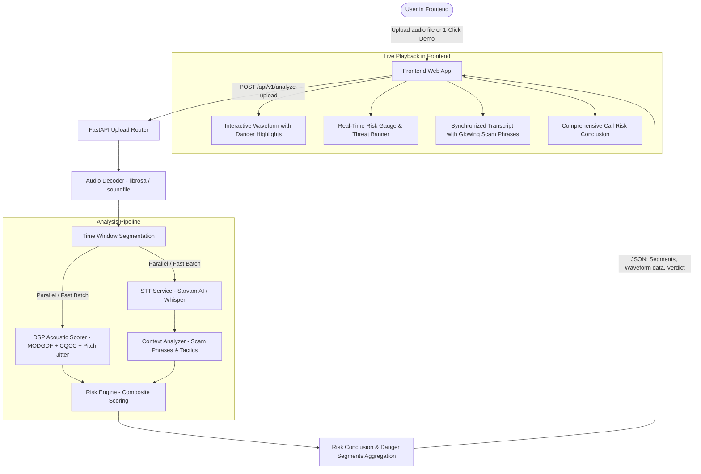

# VoiceGuard: Audio Upload & Live Call Risk Analysis

## Goal Description
Build an end-to-end feature allowing users to upload any voice recording (or pick pre-loaded sample calls) in a modern web frontend. As the audio plays live in the browser, the interface highlights in real-time which segments of the conversation are dangerous (voice spoofing, OTP/credential theft, financial extortion, urgency coercion), tracks risk metrics in sync with the audio playhead, and delivers a final conclusion on whether the call was high-risk or safe.

---

## Architecture & Data Flow

---

## User Review Required

> [!IMPORTANT]
> **Performance Optimization**: Deep-learning pitch tracking via CREPE on CPU takes ~3.8 seconds per 2-second chunk (would take ~40s for a 20s recording). We propose adding a fast FFT-based autocorrelation pitch tracker for file analysis that runs in **<5ms per chunk** (nearly 1000x faster) while computing the exact same mathematical perturbation metrics (jitter, shimmer, F0). This enables complete analysis of a 30-second call in **under 2 seconds**.

> [!NOTE]
> **Built-in 1-Click Demo Calls**: To make testing effortless even when the user does not have a recorded scam call file on hand, the frontend will include 1-click test buttons:
> 1. 🚨 **Bank OTP Scam (Synthetic Voice)**: An AI voice impersonating bank security demanding OTP and card details.
> 2. ✅ **Normal Call (Safe)**: A standard friendly conversation.

---

## Proposed Changes

### Backend

#### [MODIFY] [backend/app/ml/dsp_features.py](file:///c:/Users/ujjwa/Desktop/VsCodeFiles/VoiceGuard/backend/app/ml/dsp_features.py)
- Add fast autocorrelation-based pitch tracking fallback (`fast_pitch_jitter`) alongside CREPE.
- Allow callers to set `fast_mode=True` to achieve sub-100ms total feature extraction per chunk.

#### [NEW] [backend/app/routes/upload_analysis.py](file:///c:/Users/ujjwa/Desktop/VsCodeFiles/VoiceGuard/backend/app/routes/upload_analysis.py)
- `POST /api/v1/analyze-upload`:
  - Accepts multipart audio files (`.wav`, `.mp3`, `.m4a`, `.ogg`, `.flac`, `.webm`).
  - Reads into float32 PCM at 8 kHz / 16 kHz.
  - Computes global duration and waveform peak envelope for frontend rendering.
  - Performs STT transcription (Sarvam AI / local fallback) with phrase mapping.
  - Splits audio into sliding time windows (e.g. 2.0s chunks with 1.0s step) and computes:
    - `acoustic_score` (voice clone likelihood via DSP features)
    - `context_score` (scam phrases, credential requests, urgency tactics)
    - `risk_score` (composite rolling score)
    - `is_dangerous` flag (`warning` if score >= 50, `critical` if score >= 75)
    - `top_signals` (specific threat indicators detected in that segment)
  - Computes full-call conclusion:
    - `verdict`: `"CRITICAL RISK" | "SUSPICIOUS" | "SAFE"`
    - `peak_risk`: highest risk score across call
    - `average_risk`: mean risk score
    - `dangerous_segments`: list of dangerous time windows with timestamps (`start_sec`, `end_sec`, reason)
    - `detected_threats`: unique scam phrases detected with tiers (Critical, High, Medium)
    - `acoustic_summary`: voice clone indicators summary
    - `executive_summary`: human-readable explanation of why the call is risky or safe
    - `recommendations`: actionable advice for the user
- `GET /api/v1/sample-calls/{sample_id}`:
  - Returns pre-synthesized audio and sample analysis for instant testing.

#### [MODIFY] [backend/app/main.py](file:///c:/Users/ujjwa/Desktop/VsCodeFiles/VoiceGuard/backend/app/main.py)
- Register `upload_analysis_router`.
- Mount `StaticFiles` for serving frontend assets at `/` or `/demo`.

---

### Frontend

#### [NEW] [backend/app/static/index.html](file:///c:/Users/ujjwa/Desktop/VsCodeFiles/VoiceGuard/backend/app/static/index.html)
- Clean, semantic HTML5 structure:
  - Header with VoiceGuard branding, live server status indicator.
  - Upload zone: drag & drop, file picker, file size/format info, and 1-click sample call buttons.
  - Analysis status & progress animation.
  - Interactive player:
    - Waveform display with color-coded risk bands (Green / Amber / Crimson).
    - Play / Pause / Replay / Mute controls and scrubbing timeline.
  - **Live Playback HUD**:
    - Real-time Danger Gauge (0-100) that moves dynamically as audio plays.
    - Active Threat Banner (alerts in real time when playhead hits a scam phrase or clone artifact).
    - Synchronized dual meters: Acoustic Clone Probability vs Context Scam Risk.
  - **Synchronized Transcript View**:
    - Timestamped dialogue lines.
    - Active line highlighting following the playhead.
    - Risk badges on flagged phrases (`[OTP SOLICITATION]`, `[URGENCY]`).
    - Click-to-seek: clicking any line jumps playback to that exact second.
  - **Comprehensive Call Risk Conclusion Card**:
    - Final Verdict badge (Critical / Suspicious / Safe).
    - Metrics grid: Peak Risk, Clone Probability, Threat Phrases Count, Safe Ratio.
    - Dangerous segments breakdown table.
    - Executive summary & recommended actions.

#### [NEW] [backend/app/static/style.css](file:///c:/Users/ujjwa/Desktop/VsCodeFiles/VoiceGuard/backend/app/static/style.css)
- Premium dark-theme aesthetic:
  - Color palette: Obsidian (#080c14), Midnight Blue (#0f172a), Slate (#1e293b), Neon Crimson (#ef4444), Amber (#f59e0b), Emerald (#10b981), Cyan Accent (#06b6d4).
  - Typography: Modern Google Fonts (Inter + JetBrains Mono for metrics/timestamps).
  - Glassmorphism effects with backdrop blur and refined borders.
  - Pulse animations for active danger states and glowing risk gauges.
  - Fully responsive layout for desktop and tablet screens.

#### [NEW] [backend/app/static/app.js](file:///c:/Users/ujjwa/Desktop/VsCodeFiles/VoiceGuard/backend/app/static/app.js)
- Vanilla JavaScript (modular and clean):
  - File upload handler with drag-and-drop support.
  - HTML5 Audio / Web Audio API integration for smooth, high-precision playback tracking (using `requestAnimationFrame` or `timeupdate` for 60fps playhead sync).
  - Dynamic canvas-based waveform rendering with danger zone highlight overlays.
  - Real-time synchronization loop:
    - Reads `audio.currentTime`
    - Finds active audio chunk in pre-computed analysis array
    - Updates Danger Gauge, Threat Banner, and Transcript highlights in real time
  - Interactive seek handlers on waveform and transcript.
  - Sample call loader for 1-click instant demo.

---

## Verification Plan

### Automated Tests
1. Generate test audio files (one scam scenario with keywords "OTP", "card number", "urgent", and one normal scenario).
2. Test `POST /api/v1/analyze-upload` using `httpx`/`curl`:
   - Verify 200 OK response.
   - Verify presence of `chunks`, `waveform_peaks`, `dangerous_segments`, `conclusion`.
   - Verify peak risk > 80% for scam call and < 30% for safe call.

### Manual Verification in Browser
1. Start backend server with uvicorn.
2. Launch browser to `http://localhost:8000/`.
3. Test 1-click sample scam call:
   - Click "Test Scam Call".
   - Verify waveform renders with red danger zones.
   - Click Play and observe live risk meter surging when "OTP" / "card number" is spoken.
   - Verify transcript auto-highlights in sync with audio.
   - Verify final conclusion card shows "CRITICAL RISK - SCAM DETECTED".
4. Test file upload:
   - Drag and drop an audio file.
   - Verify analysis finishes rapidly (<3s) and displays results.
